# FAF Flow Edit

A deep learning project for **Fundus Autofluorescence (FAF) image generation and editing** using Scalable Interpolant Transformers (SiT). This repository enables conditional generation of synthetic FAF images based on genetic mutations, patient age, and eye laterality, with support for real-to-latent inversion and semantic image editing.

<p>
  <a href="#overview"></a>
  <a href="#prerequisites"></a>
  <a href="#environment-setup"></a>
  <a href="#dataset"></a>
  <a href="#training"></a>
  <a href="#sampling"></a>
  <a href="#inversion-and-editing"></a>
  <a href="#evaluation"></a>
  <a href="#project-structure"></a>
  <a href="#citation"></a>
</p>

---

## Overview

This project implements a flow-based generative model (SiT) for synthesizing and editing FAF images conditioned on:

- **Gene**: The genetic mutation associated with inherited retinal diseases (36 gene classes)
- **Laterality**: Left (L) or Right (R) eye
- **Age**: Patient age (normalized 0-100)

The model supports:
1. **Conditional Generation**: Generate novel FAF images given specific conditions
2. **Image Inversion**: Map real FAF images back to the latent space
3. **Semantic Editing**: Modify conditions (gene, age, laterality) to generate edited versions of real images

---

## Features

- Multi-conditional generation (gene, laterality, age)
- ODE-based image inversion for real images
- Semantic editing via latent space manipulation
- Comprehensive evaluation suite (conditioning accuracy, FID, TSTR)
- Distributed training with PyTorch DDP
- Weights & Biases integration for experiment tracking

---

## Prerequisites

- **Operating System**: Linux (tested on Ubuntu)
- **GPU**: NVIDIA GPU with CUDA support (recommended: A100, V100, or RTX 3090+)
- **CUDA**: Version 11.x or higher
- **Conda**: Miniconda or Anaconda for environment management
- **Python**: 3.10+
- **Storage**: ~50GB for datasets and checkpoints

---

## Project Structure

```
faf_flow_edit/
├── data/                          # Datasets and metadata
│   ├── class_mapping.json         # Gene-to-index mapping
│   ├── images_cleaned/            # Cleaned full-resolution images
│   ├── images_256_cleaned/        # Resized 256x256 images
│   ├── synthetic_10kSamples/      # Generated synthetic datasets
│   └── eval_10kSamples_256res/    # Evaluation datasets
├── environments/                  # Conda environment files
│   ├── env_sit.yml
│   └── env_stylegan2ada.yml
├── evaluation/                    # Evaluation results
│   ├── conditioning_results_*/    # Conditioning evaluation outputs
│   └── TSTR_reports/              # TSTR classification reports
├── scripts/
│   ├── evaluation/                # Evaluation scripts
│   │   ├── evaluate_conditioning.py
│   │   └── run_tstr.py
│   └── prepare_datasets/          # Data preparation scripts
│       ├── clean_dataset.py
│       ├── resize_dataset.py
│       └── generate_synthetic_dataset.py
├── SiT/                           # Core SiT model
│   ├── train.py                   # Training script
│   ├── sample.py                  # Sampling script
│   ├── invert.py                  # Inversion and editing
│   ├── dataset.py                 # Custom dataset class
│   ├── models.py                  # Model architectures
│   ├── transport/                 # Flow matching transport
│   ├── weights/                   # Model checkpoints
│   ├── inversions/                # Inversion outputs
│   └── edits/                     # Editing outputs
└── stylegan2-ada-pytorch/         # StyleGAN2-ADA baseline
```

---

## Environment Setup

### 1. Clone the Repository

```bash
git clone <repository-url>
cd faf_flow_edit
```

### 2. Create the Conda Environment

The SiT environment includes all necessary dependencies:

```bash
conda env create -f environments/env_sit.yml
conda activate SiT_flow
```

This installs:
- PyTorch with CUDA support
- Diffusers (for VAE)
- torchvision, numpy, pandas
- pytorch-fid (for FID computation)
- wandb (for experiment tracking)

### 3. (Optional) StyleGAN2-ADA Environment

If you plan to compare with StyleGAN2-ADA:

```bash
conda env create -f environments/env_stylegan2ada.yml
conda activate stylegan2ada
```

---

## Dataset

### About the Data

> **Confidential Medical Data**: This project uses clinical Fundus Autofluorescence (FAF) images from patients with inherited retinal diseases provided by Moorfields Eye Hospital. The data is confidential and not publicly available.

**Dataset Statistics:**
- **Total Samples**: ~34,000 FAF images after cleaning
- **Gene Classes**: 36 unique genetic mutations
- **Image Resolution**: Original variable resolution, standardized to 256×256 for training
- **Attributes per Image**:
  - `file_name`: Image filename
  - `gene`: Genetic mutation (e.g., ABCA4, USH2A, CHM)
  - `laterality`: Eye side (L/R)
  - `age`: Patient age at imaging

**Class Mapping** (`data/class_mapping.json`):
```json
{"ABCA4": 0, "BBS1": 1, "BEST1": 2, ..., "USH2A": 35}
```

### Cleaning the Dataset

The cleaning script filters images to include only samples with valid gene labels from the class mapping:

```bash
python scripts/prepare_datasets/clean_dataset.py \
    --input_csv <path/to/original_metadata.csv> \
    --class_mapping_json data/class_mapping.json \
    --output_csv data/images_cleaned/metadata_cleaned.csv \
    --source_images_dir <path/to/original_images> \
    --output_images_dir data/images_cleaned
```

**What it does:**
1. Filters metadata CSV to keep only genes present in `class_mapping.json`
2. Copies corresponding images to the cleaned directory
3. Reports statistics on filtered and missing files

### Resizing Images

SiT requires images at a fixed resolution (256×256). Resize the cleaned dataset:

```bash
python scripts/prepare_datasets/resize_dataset.py \
    --src data/images_cleaned \
    --dest data/images_256_cleaned \
    --size 256
```

**Features:**
- Multi-threaded processing for speed
- High-quality LANCZOS resampling
- Automatic handling of various image formats (PNG, JPG, JPEG)

After resizing, create the metadata file for the resized images:

```bash
python scripts/prepare_datasets/create_metadata_256.py \
    --input_csv data/images_cleaned/metadata_cleaned.csv \
    --output_csv data/images_256_cleaned/metadata_cleaned_256.csv
```

---

## Training

### Training SiT on FAF Images

Train the SiT model using Distributed Data Parallel (DDP):

```bash
cd SiT

torchrun --nproc_per_node=<NUM_GPUS> train.py \
    --data-path ../data/images_256_cleaned/metadata_cleaned_256.csv \
    --img-dir ../data/images_256_cleaned \
    --mapping-file ../data/class_mapping.json \
    --model SiT-XL/2 \
    --image-size 256 \
    --epochs 1400 \
    --global-batch-size 256 \
    --results-dir results \
    --ckpt-every 50000 \
    --sample-every 10000 \
    --log-every 100 \
    --cfg-scale 4.0 \
    --wandb
```

**Key Arguments:**
| Argument | Description | Default |
|----------|-------------|---------|
| `--data-path` | Path to metadata CSV | Required |
| `--img-dir` | Directory containing images | Required |
| `--mapping-file` | Gene-to-index JSON mapping | Required |
| `--model` | Model architecture | `SiT-XL/2` |
| `--image-size` | Training resolution | `256` |
| `--epochs` | Number of training epochs | `1400` |
| `--global-batch-size` | Total batch size across GPUs | `256` |
| `--cfg-scale` | Classifier-free guidance scale | `4.0` |
| `--wandb` | Enable W&B logging | Flag |
| `--ckpt` | Resume from checkpoint | Optional |

**Resume Training:**
```bash
torchrun --nproc_per_node=<NUM_GPUS> train.py \
    --data-path ../data/images_256_cleaned/metadata_cleaned_256.csv \
    --img-dir ../data/images_256_cleaned \
    --mapping-file ../data/class_mapping.json \
    --ckpt results/<experiment>/checkpoints/<step>.pt \
    ...
```

---

## Sampling

### Generating Synthetic Images

Generate individual samples with specific conditions:

```bash
cd SiT

python sample.py \
    --ckpt weights/<checkpoint>.pt \
    --mapping-file ../data/class_mapping.json \
    --gene ABCA4 \
    --laterality L \
    --age 45 \
    --num-samples 4 \
    --cfg-scale 4.0 \
    --output-dir samples
```

### Generating Large-Scale Datasets

Generate thousands of samples matching the demographic distribution of real data:

```bash
python scripts/prepare_datasets/generate_synthetic_dataset.py \
    --ckpt SiT/weights/<checkpoint>.pt \
    --data-path data/images_256_cleaned/metadata_cleaned_256.csv \
    --mapping-file data/class_mapping.json \
    --output-dir data/synthetic_10kSamples \
    --num-samples 10000 \
    --batch-size 32 \
    --cfg-scale 4.0 \
    --seed 42
```

This script:
1. Samples demographic distributions (gene, age, laterality) from real metadata
2. Generates synthetic images matching those distributions
3. Creates a manifest CSV for evaluation

---

## Inversion and Editing

### Inverting Real Images to Latent Space

Invert a real FAF image to obtain its latent noise representation:

```bash
cd SiT

python invert.py invert \
    --ckpt weights/<checkpoint>.pt \
    --input-image <path/to/real_image.png> \
    --gene ABCA4 \
    --laterality L \
    --age 55 \
    --mapping-file ../data/class_mapping.json \
    --output-dir inversions \
    --verify
```

**Arguments:**
| Argument | Description |
|----------|-------------|
| `--ckpt` | Path to trained model checkpoint |
| `--input-image` | Path to real FAF image |
| `--gene` | Gene label of the input image |
| `--laterality` | Eye laterality (L/R) |
| `--age` | Patient age |
| `--verify` | Reconstruct image to verify inversion quality |
| `--output-dir` | Directory to save outputs |

**Outputs:**
- `inverted_noise.pt`: Latent noise tensor with metadata
- `reconstruction.png`: Reconstructed image (if `--verify` flag used)
- `original.png`: Copy of input image for comparison

**ODE Solver Options:**
```bash
--sampling-method dopri5  # ODE solver: dopri5, euler, heun
--num-steps 50            # Number of ODE steps
--atol 1e-6               # Absolute tolerance
--rtol 1e-3               # Relative tolerance
```

### Editing Latent Representations

Edit an inverted image by changing its conditioning attributes:

```bash
cd SiT

python invert.py edit \
    --ckpt weights/<checkpoint>.pt \
    --noise-file inversions/inverted_noise.pt \
    --target-gene USH2A \
    --target-age 70 \
    --target-laterality R \
    --mapping-file ../data/class_mapping.json \
    --output-dir edits
```

**Arguments:**
| Argument | Description |
|----------|-------------|
| `--noise-file` | Path to inverted noise (.pt file) |
| `--target-gene` | New gene (or None to keep original) |
| `--target-laterality` | New laterality (or None to keep) |
| `--target-age` | New age (or None to keep) |

### Editing Examples

Below are real experiments demonstrating the inversion and editing pipeline on a sample FAF image.

#### Step 1: Inversion

Invert a real ABCA4 patient image (Right eye, Age 32) to latent space:

```bash
cd SiT

python invert.py invert \
    --ckpt weights/<checkpoint>.pt \
    --input-image ../data/eval_10kSamples_256res/real_10kSamples_256res/00000018.pat_00448798.sdb_AF_B-0_0.png \
    --gene ABCA4 \
    --laterality R \
    --age 32 \
    --output-dir inversions/00000018_pat_00448798_sdb \
    --verify
```

<details>
<summary>Terminal Output</summary>

```
Loading checkpoint: weights/<checkpoint>.pt
Loaded config from checkpoint: Model=SiT-XL/2, Size=256
Condition: Gene=ABCA4(0), Eye=R(1), Age=32(0.32)
Loading EMA weights...
Encoded to latent shape: torch.Size([1, 4, 32, 32])

Inverting (Data -> Noise)...
Inverted noise shape: torch.Size([1, 4, 32, 32])
Inverted noise stats: mean=0.0040, std=0.9685
SUCCESS: Inverted noise saved to inversions/00000018_pat_00448798_sdb/inverted_noise.pt

Verifying (Noise -> Data reconstruction)...
SUCCESS: Reconstruction saved to inversions/00000018_pat_00448798_sdb/reconstruction.png
SUCCESS: Original saved to inversions/00000018_pat_00448798_sdb/original.png
Latent reconstruction MSE: 0.000006
```
</details>

| Original (ABCA4, R, 32) | Reconstructed (ABCA4, R, 32) |
|:-----------------------:|:----------------------------:|
| 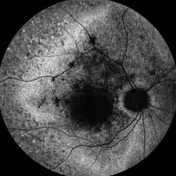 | 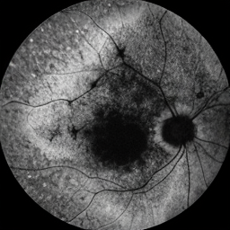 |

The low reconstruction MSE (0.000006) confirms high-quality inversion.

---

#### Step 2: Single Attribute Editing

**Age Editing** — Increase or decrease patient age:

```bash
# Increase age: 32 → 65
python invert.py edit \
    --ckpt weights/<checkpoint>.pt \
    --noise-file inversions/00000018_pat_00448798_sdb/inverted_noise.pt \
    --target-age 65 \
    --output-dir edits/00000018_pat_00448798_sdb

# Decrease age: 32 → 20
python invert.py edit \
    --ckpt weights/<checkpoint>.pt \
    --noise-file inversions/00000018_pat_00448798_sdb/inverted_noise.pt \
    --target-age 20 \
    --output-dir edits/00000018_pat_00448798_sdb
```

| Reconstructed (Age 32) | Older (Age 65) | Younger (Age 20) |
|:----------------------:|:--------------:|:----------------:|
|  |  | 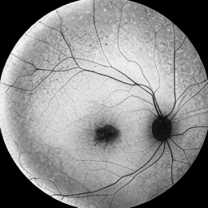 |

---

**Laterality Editing** — Flip from Right to Left eye:

```bash
# Flip laterality: R → L
python invert.py edit \
    --ckpt weights/<checkpoint>.pt \
    --noise-file inversions/00000018_pat_00448798_sdb/inverted_noise.pt \
    --target-laterality L \
    --output-dir edits/00000018_pat_00448798_sdb
```

| Reconstructed (R) | Edited (L) |
|:-----------------:|:----------:|
|  | 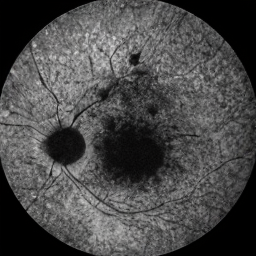 |

---

**Gene Editing** — Transform between genetic phenotypes:

```bash
# Change gene: ABCA4 → USH2A
python invert.py edit \
    --ckpt weights/<checkpoint>.pt \
    --noise-file inversions/00000018_pat_00448798_sdb/inverted_noise.pt \
    --target-gene USH2A \
    --output-dir edits/00000018_pat_00448798_sdb

# Change gene: ABCA4 → OPA1
python invert.py edit \
    --ckpt weights/<checkpoint>.pt \
    --noise-file inversions/00000018_pat_00448798_sdb/inverted_noise.pt \
    --target-gene OPA1 \
    --output-dir edits/00000018_pat_00448798_sdb
```

| Reconstructed (ABCA4) | Edited (USH2A) | Edited (OPA1) |
|:---------------------:|:--------------:|:-------------:|
|  |  | 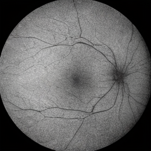 |

---

#### Step 3: Multi-Attribute Editing

**Gene + Age:**

```bash
# USH2A + Age 65
python invert.py edit \
    --ckpt weights/<checkpoint>.pt \
    --noise-file inversions/00000018_pat_00448798_sdb/inverted_noise.pt \
    --target-gene USH2A \
    --target-age 65 \
    --output-dir edits/00000018_pat_00448798_sdb

# USH2A + Age 20
python invert.py edit \
    --ckpt weights/<checkpoint>.pt \
    --noise-file inversions/00000018_pat_00448798_sdb/inverted_noise.pt \
    --target-gene USH2A \
    --target-age 20 \
    --output-dir edits/00000018_pat_00448798_sdb
```

| Reconstructed (ABCA4, 32) | USH2A + Age 65 | USH2A + Age 20 |
|:-------------------------:|:--------------:|:--------------:|
|  | 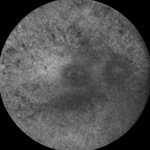 | 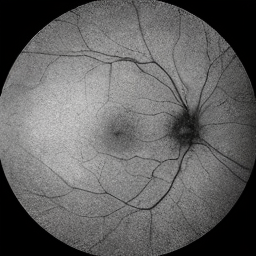 |

---

**Gene + Laterality:**

```bash
# USH2A + Left Eye
python invert.py edit \
    --ckpt weights/<checkpoint>.pt \
    --noise-file inversions/00000018_pat_00448798_sdb/inverted_noise.pt \
    --target-gene USH2A \
    --target-laterality L \
    --output-dir edits/00000018_pat_00448798_sdb

# OPA1 + Left Eye
python invert.py edit \
    --ckpt weights/<checkpoint>.pt \
    --noise-file inversions/00000018_pat_00448798_sdb/inverted_noise.pt \
    --target-gene OPA1 \
    --target-laterality L \
    --output-dir edits/00000018_pat_00448798_sdb
```

| Reconstructed (ABCA4, R) | USH2A + L | OPA1 + L |
|:------------------------:|:---------:|:--------:|
|  | 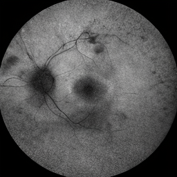 | 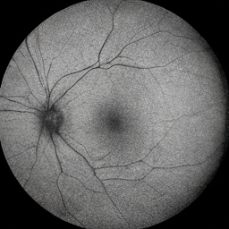 |

---

**Age + Laterality:**

```bash
# Left Eye + Age 65
python invert.py edit \
    --ckpt weights/<checkpoint>.pt \
    --noise-file inversions/00000018_pat_00448798_sdb/inverted_noise.pt \
    --target-laterality L \
    --target-age 65 \
    --output-dir edits/00000018_pat_00448798_sdb
```

| Reconstructed (R, 32) | Edited (L, 65) |
|:---------------------:|:--------------:|
|  | 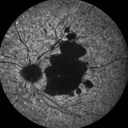 |

---

#### Step 4: Triple Attribute Editing (Gene + Age + Laterality)

```bash
# USH2A + Left Eye + Age 75
python invert.py edit \
    --ckpt weights/<checkpoint>.pt \
    --noise-file inversions/00000018_pat_00448798_sdb/inverted_noise.pt \
    --target-gene USH2A \
    --target-laterality L \
    --target-age 75 \
    --output-dir edits/00000018_pat_00448798_sdb

# OPA1 + Right Eye + Age 40
python invert.py edit \
    --ckpt weights/<checkpoint>.pt \
    --noise-file inversions/00000018_pat_00448798_sdb/inverted_noise.pt \
    --target-gene OPA1 \
    --target-laterality R \
    --target-age 40 \
    --output-dir edits/00000018_pat_00448798_sdb
```

| Reconstructed (ABCA4, R, 32) | USH2A, L, 75 | OPA1, R, 40 |
|:----------------------------:|:------------:|:-----------:|
|  | 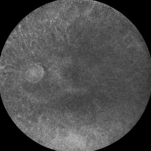 | 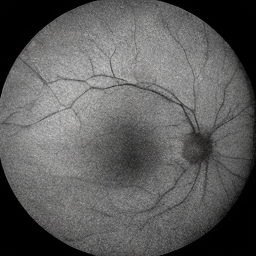 |

---

## Evaluation

### Conditioning Evaluation

Evaluate how well synthetic images match their conditioning labels using trained judge classifiers:

```bash
python scripts/evaluation/evaluate_conditioning.py \
    --real-csv data/images_256_cleaned/metadata_cleaned_256.csv \
    --real-img-dir data/images_256_cleaned \
    --synth-csv data/synthetic_10kSamples/synthetic_manifest.csv \
    --synth-img-dir data/synthetic_10kSamples \
    --output-dir evaluation/conditioning_results_10k \
    --train-samples 5000 \
    --batch-size 64 \
    --epochs 5 \
    --save-models
```

**What it evaluates:**
- **Laterality Accuracy**: Classification accuracy for L/R prediction
- **Age Correlation**: R² and MAE for age regression

**Example Results (10k samples):**
```
LATERALITY
------------------------------
Overall Accuracy: 95.15%
Left Eye Accuracy: 93.74%
Right Eye Accuracy: 96.52%

AGE
------------------------------
Correlation (R): 0.8488
Mean Absolute Error: 14.84 years
```

**Evaluation-only mode** (using pre-trained judges):
```bash
python scripts/evaluation/evaluate_conditioning.py \
    --synth-csv data/synthetic_10kSamples/synthetic_manifest.csv \
    --synth-img-dir data/synthetic_10kSamples \
    --output-dir evaluation/conditioning_results_10k \
    --eval-only
```

### FID Evaluation

Compute Fréchet Inception Distance (FID) to measure image quality and diversity.

**Using pytorch-fid:**
```bash
# Ensure both directories contain images at the same resolution
python -m pytorch_fid \
    data/eval_10kSamples_256res/real_10kSamples_256res \
    data/eval_10kSamples_256res/synthetic_10kSamples_SiT_256res
```

**Using StyleGAN2-ADA's calc_metrics.py:**
```bash
cd stylegan2-ada-pytorch

python calc_metrics.py \
    --network <path/to/network.pkl> \
    --metrics fid50k_full \
    --data <path/to/real_dataset_zip_or_folder>
```

**Compare SiT vs StyleGAN2-ADA:**
```bash
# SiT FID
python -m pytorch_fid \
    data/eval_10kSamples_256res/real_10kSamples_256res \
    data/eval_10kSamples_256res/synthetic_10kSamples_SiT_256res

# StyleGAN2-ADA FID
python -m pytorch_fid \
    data/eval_10kSamples_256res/real_10kSamples_256res \
    data/eval_10kSamples_256res/synthetic_10kSamples_stylegan2ada_256res
```

### TSTR Classifier Evaluation

**Train on Synthetic, Test on Real (TSTR)** evaluation measures how well a classifier trained on synthetic data performs on real data:

```bash
# Evaluate SiT synthetic data
python scripts/evaluation/run_tstr.py \
    --experiment_name TSTR_SiT \
    --train_csv data/synthetic_10kSamples/synthetic_manifest.csv \
    --train_img_dir data/eval_10kSamples_256res/synthetic_10kSamples_SiT_256res \
    --train_mode synthetic \
    --test_csv data/images_256_cleaned/metadata_cleaned_256.csv \
    --test_img_dir data/images_256_cleaned \
    --test_mode real \
    --mapping_json data/class_mapping.json \
    --outdir evaluation/TSTR_reports \
    --batch_size 32 \
    --epochs 10

# Evaluate StyleGAN2-ADA synthetic data
python scripts/evaluation/run_tstr.py \
    --experiment_name TSTR_SG2ADA \
    --train_csv data/synthetic_10kSamples_stylegan2ada/stylegan_manifest.csv \
    --train_img_dir data/eval_10kSamples_256res/synthetic_10kSamples_stylegan2ada_256res \
    --train_mode synthetic \
    --test_csv data/images_256_cleaned/metadata_cleaned_256.csv \
    --test_img_dir data/images_256_cleaned \
    --test_mode real \
    --mapping_json data/class_mapping.json \
    --outdir evaluation/TSTR_reports \
    --batch_size 32 \
    --epochs 10

# Real data upper bound (Train on Real, Test on Real)
python scripts/evaluation/run_tstr.py \
    --experiment_name TSTR_Real \
    --train_csv data/eval_10kSamples_256res/real_10kSamples_train.csv \
    --train_img_dir data/eval_10kSamples_256res/real_10kSamples_256res \
    --train_mode real \
    --test_csv data/images_256_cleaned/metadata_cleaned_256.csv \
    --test_img_dir data/images_256_cleaned \
    --test_mode real \
    --mapping_json data/class_mapping.json \
    --outdir evaluation/TSTR_reports \
    --batch_size 32 \
    --epochs 10
```

**Example Results (10k samples):**
| Model | Test Accuracy |
|-------|---------------|
| Real (Upper Bound) | 78.92% |
| SiT | 67.85% |
| StyleGAN2-ADA | 46.33% |

---

## Citation

If you use this code in your research, please cite:

```bibtex
@article{faf_flow_edit,
  title={Conditional FAF Image Synthesis and Editing with Scalable Interpolant Transformers},
  author={...},
  year={2025}
}
```

**SiT Paper:**
```bibtex
@article{ma2024sit,
  title={SiT: Exploring Flow and Diffusion-based Generative Models with Scalable Interpolant Transformers},
  author={Ma, Nanye and Goldstein, Mark and Albergo, Michael S and Boffi, Nicholas M and Vanden-Eijnden, Eric and Xie, Saining},
  journal={arXiv preprint arXiv:2401.08740},
  year={2024}
}
```

---

## License

This project is licensed under the terms specified in [LICENSE.txt](SiT/LICENSE.txt).

**Note**: The medical imaging data used in this project is confidential and not included in this repository. Please ensure you have appropriate permissions and ethics approval before working with medical imaging data.
